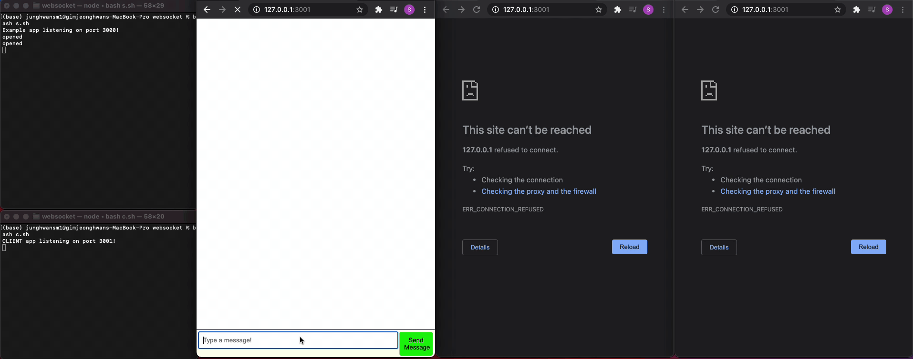

# websocket_chat



## How to Use: 
Run Server and Client
```
bash s.sh
```
```
bash c.sh
```
Server runs on http://localhost:3000/
Client runs on http://localhost:3001/

To chat, go to http://localhost:3001/
A prompt will appear, asking for your username.
Start Chatting!